# PHM

## （x / y / z 軸振動、電壓）4種訊號， 健康(Healthy)與 故障 (Faulty1 & Faulty2) 的疊加波形圖，
##  用於直觀觀察不同故障型態的振動幅值差異
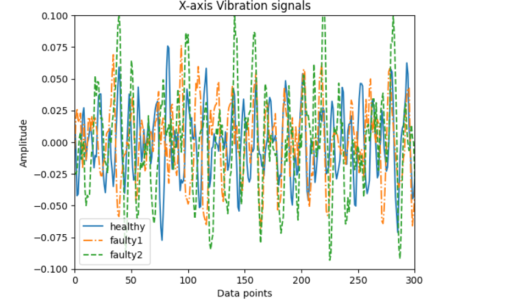
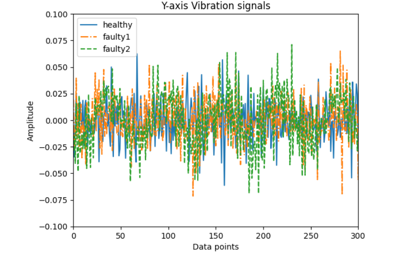
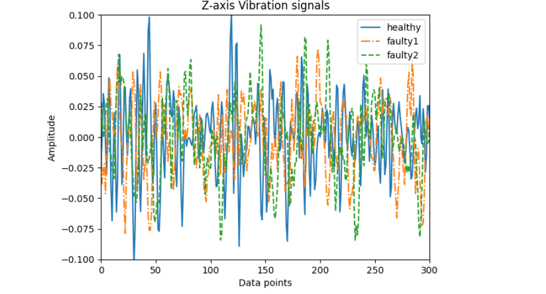
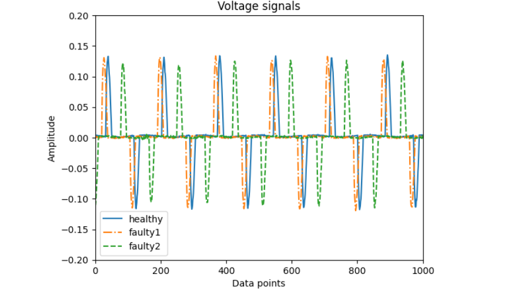

## 針對4種訊號，皆各進行20種的特徵提取(12個時域特徵:下圖 & 8個頻域特徵: 快速傅立葉一倍頻~八倍頻)，共有80個特徵
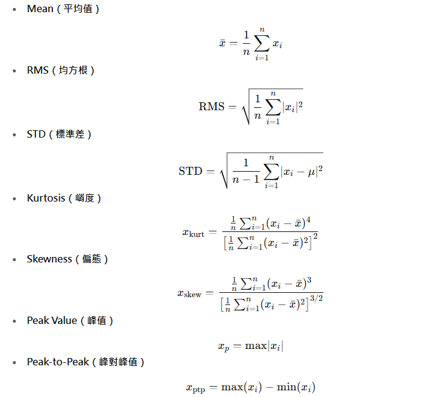
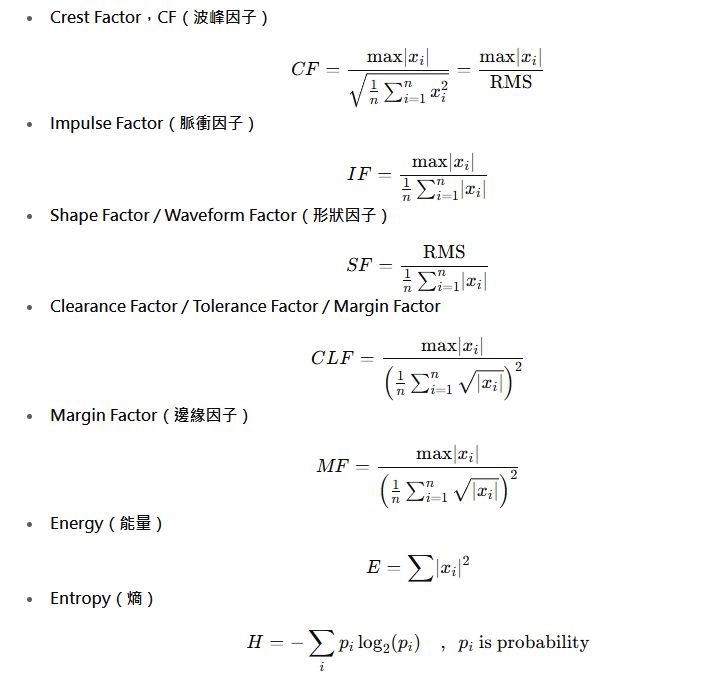

## 費雪法則(Fisher Score)的公式與示意圖介紹

Fisher Score 以「**類間均值差距** / **類內變異**」
來評分每一個特徵；差距越大且類內越集中者，分數越高、可分性越好。
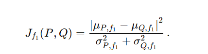
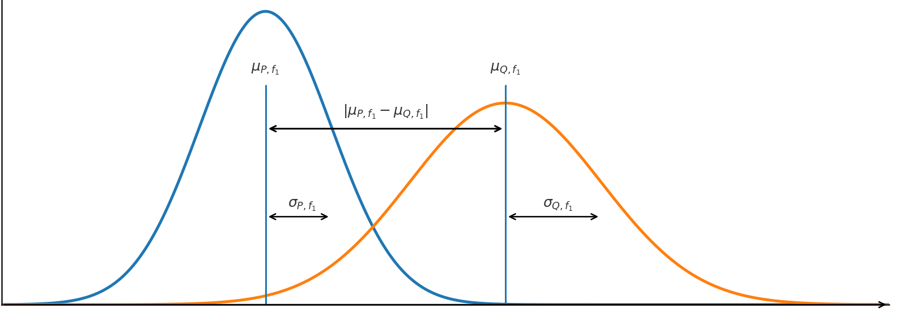

## 計算特徵之Fisher Score，以voltage-mean, voltage-Shape Factor的分數最高，以這些特徵來完成後續之分群之依據。

## 由以下架構方式，完成專案

## 結果
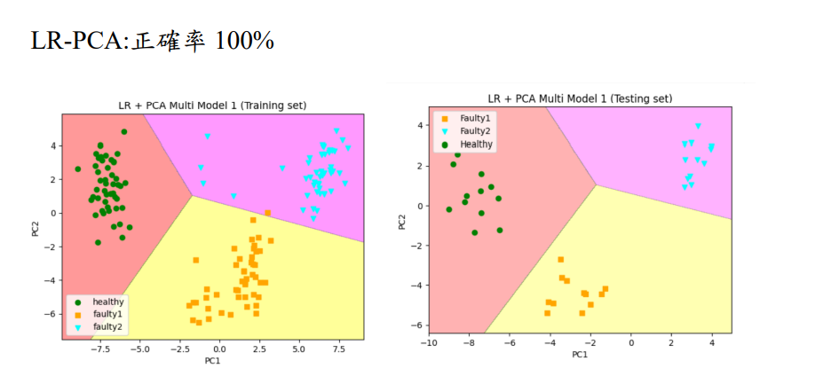

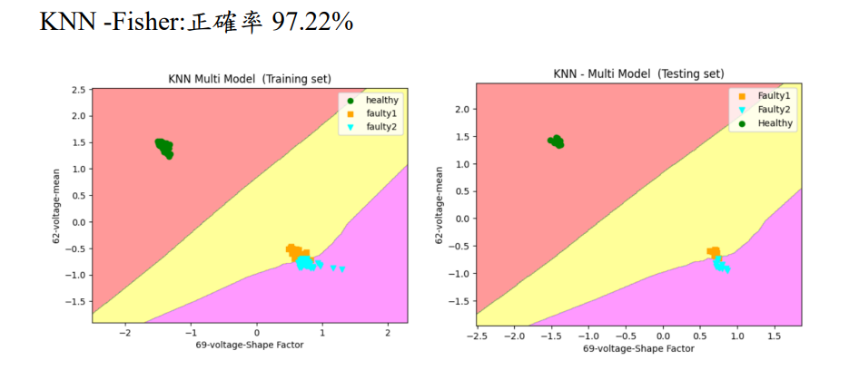
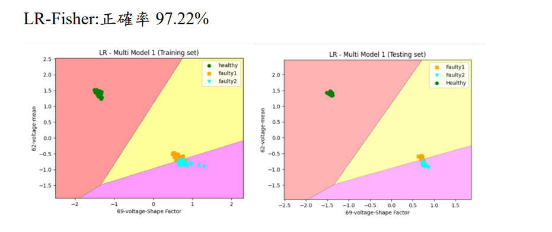
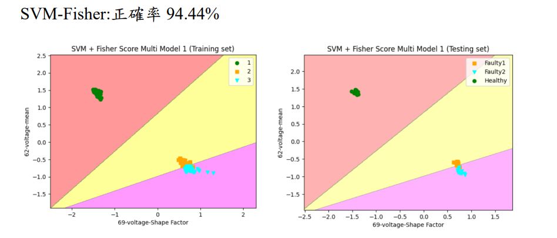

